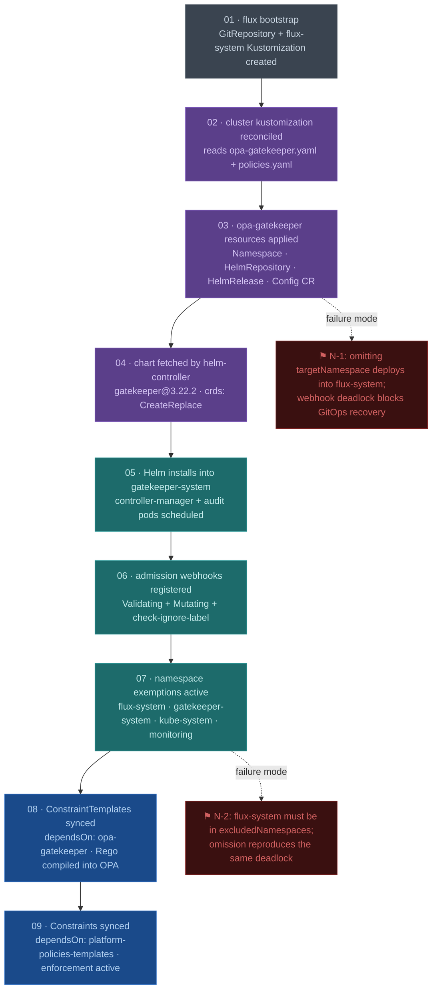

# ADR-0004: Use OPA Gatekeeper for Platform Admission Control

## Status

**Accepted**

---

## Context

The AI platform requires a policy enforcement layer that intercepts resource creation
and mutation at the Kubernetes API server boundary. Without this, any workload can be
deployed into any namespace, with any service type, using any container image — which
directly contradicts the zero-trust posture required for a multi-tenant AI platform
and the compliance surface targeted in later weeks (SOC2, FinServ patterns).

The platform runs on k3d locally and will be validated against AKS. Local policy must
therefore map semantically to Azure Policy, because the two enforcement planes will
govern the same workload categories: model deployments, RAG pipeline components,
tenant namespaces, and ingress endpoints.

The immediate policies to enforce are:

- All containers must declare CPU and memory resource limits
- Services of type `LoadBalancer` are denied outside permitted ingress namespaces
- Workloads with an `app.kubernetes.io/component: model` label may only run in the
  `ai-workloads` namespace

Longer-term (Weeks 5–10), the same enforcement layer governs tenant namespace
isolation, Qdrant collection ownership, and multi-tenant RBAC scope boundaries.

### Drivers

| Driver | Description |
|--------|-------------|
| **Functional** | Intercept and enforce at admission time, not post-deployment audit |
| **Operational** | Policies must be GitOps-managed (Flux-owned), version-controlled, and auditable |
| **Security** | Enforce namespace isolation, restrict model placement, deny uncontrolled egress |
| **Cost** | No additional cloud spend; runs in-cluster on existing k3d nodes |
| **Team** | Single operator (Israel); policy authoring must be learnable without a dedicated platform security team |
| **Architecture** | Policy model must map to Azure Policy for AKS validation without a full rewrite |

---

## Decision

**We will use OPA Gatekeeper 3.22.2, deployed as a Flux HelmRelease into a dedicated
`gatekeeper-system` namespace, as the sole admission control enforcement engine for
the AI platform cluster.**

ConstraintTemplates (Rego logic) and Constraints (enforcement config) are managed
separately in `policies/templates/` and `policies/constraints/` at the repo root,
applied via a Flux Kustomization that `dependsOn` the Gatekeeper HelmRelease.

### Rationale

**Why OPA Gatekeeper over Kyverno:**
Kyverno policies are written as Kubernetes-native YAML with CEL-like expressions — an
easier authoring experience, but a different policy model from Azure Policy. Azure
Policy for AKS uses the OPA engine directly; a Gatekeeper ConstraintTemplate maps
with near 1:1 fidelity to an Azure Policy initiative definition using the same Rego
logic. This is the primary differentiator. The Cloudville AI platform will eventually
need to demonstrate compliance validation against Azure Policy — building policy
in Rego now means the same logic is portable, not a rewrite.

Kyverno is a legitimate choice for teams that do not need the Azure Policy mapping.
It would be the right choice if the platform were AWS/GCP or purely cloud-agnostic.

**Why OPA Gatekeeper over Kubernetes Validating Admission Policy (VAP/CEL):**
VAP is built into the API server from K8s 1.26+ and requires no CRD overhead. It is
the long-term direction of the upstream project. However, as of K8s 1.34 (the range
this programme targets), VAP/CEL has critical gaps for this use case:

- No mutation support (MutatingAdmissionPolicy is alpha as of 1.32)
- Audit mode for reporting violations without denying is less mature than Gatekeeper's
  `warn` and `audit` enforcement action modes
- No equivalent to Gatekeeper's `constraint-violations-limit` or audit reporting CRDs
- CEL expressions are more readable but less expressive than Rego for complex
  contextual policies (e.g. "deny LoadBalancer unless namespace is in this list")

VAP is the right long-term choice once it achieves feature parity. The conditions
under which this ADR should be revisited are explicit below.

**Why a dedicated `gatekeeper-system` namespace:**
Gatekeeper's admission webhook intercepts operations on all namespaces unless
exemptions are explicitly configured. Placing Gatekeeper in `flux-system` (the default
when `targetNamespace` is omitted from the HelmRelease) means Gatekeeper's webhook
fires against Flux's own reconciliation dry-runs. This creates a bootstrap deadlock
class where a misbehaving Gatekeeper installation can make itself irrecoverable via
GitOps alone. Namespace isolation is not cosmetic — it is a prerequisite for a
recoverable failure mode. See RCA: `docs/rca/rca-gatekeeper-flux-bootstrap.md`.

**Why deployed via Flux HelmRelease rather than direct Helm install:**
Gatekeeper is a platform component in the Flux-owned layer (per the programme's
GitOps split pattern). Installing it with `helm install` makes it invisible to the
GitOps reconciliation loop. Any configuration drift, version mismatch, or accidental
manual change would not be detected or corrected. More importantly: Gatekeeper's
policies should themselves be under the same GitOps control as Gatekeeper — and that
requires Flux to know Gatekeeper exists. The HelmRelease also enables the
`dependsOn` chain that ensures ConstraintTemplates are only applied after Gatekeeper's
CRDs exist, preventing a class of race-condition failures on cluster restart.

---

## Consequences

### Positive

- Policy authoring in Rego directly transfers to Azure Policy for AKS validation —
  the same Rego file, packaged differently
- Gatekeeper's `audit` mode surfaces existing violations without blocking deployments,
  enabling incremental policy rollout without a big-bang enforcement event
- `warn` enforcement action allows policy development with real workloads before
  switching to `deny` — critical for a learning environment where breakage is
  intentional
- The ConstraintTemplate / Constraint separation mirrors Azure Policy's initiative /
  assignment model, making the architecture legible to Azure-native operators
- Policies are version-controlled, diff-able, and PR-reviewable as Kubernetes
  manifests — no policy portal required

### Negative / Trade-offs

- Rego has a learning curve that is steeper than CEL or Kyverno's YAML-native
  expression model; policy authoring requires understanding OPA's evaluation model
- Gatekeeper adds two pods and two CRD groups to the cluster; on a single-node k3d
  cluster this is non-trivial overhead
- Webhook failures in fail-close mode block all resource operations, not just
  policy-relevant ones — a crashed Gatekeeper pod during an incident is an incident
  multiplier
- The ConstraintTemplate → Constraint split means every new policy requires two
  files; simpler constraints feel over-engineered relative to their complexity

### Risks & Mitigations

| Risk | Likelihood | Impact | Mitigation |
|------|-----------|--------|------------|
| Webhook deadlock blocks Flux reconciliation | Med | High | Exempt `flux-system` and `gatekeeper-system` in `values.exemptNamespaces`; document recovery procedure in RCA |
| Overly broad `deny` policies block legitimate platform workloads | Med | High | Always deploy in `warn` mode first; use Gatekeeper audit reports before switching to `deny` |
| Gatekeeper pod crash causes cluster-wide admission failure | Low | High | `failurePolicy: Ignore` on non-critical webhooks; pin `replicas: 1` is acceptable for k3d but set to 2 on AKS |
| Rego policy logic error causes silent permit instead of deny | Low | Med | Use `BREAK/FIX` depth tasks to deliberately test violation paths; include negative tests in the repo |
| VAP/CEL matures faster than expected, making this decision obsolete | High | Low | Decision is revisitable; Rego policies are portable to `ValidatingAdmissionPolicy` with mechanical translation |

---

## Alternatives Considered

### Option A: Kyverno

**Description:** Kyverno is a Kubernetes-native policy engine that uses YAML-based
policy definitions. Policies are simpler to author — a `ClusterPolicy` resource
contains the rules directly without a separate CRD/instance split. Kyverno also
supports generate and mutate rules with a more ergonomic model than Rego.

**Rejected because:** Kyverno policies do not map to Azure Policy's OPA engine. The
programme's Azure validation path requires demonstrating that local policies translate
to Azure Policy for AKS — Kyverno policies would require a complete rewrite at that
boundary. Additionally, Kyverno's `generate` feature (creating resources on namespace
creation) overlaps with Flux's responsibility in the GitOps split pattern; the
interaction between Kyverno's generator and Flux's reconciler is an untested
combination in this architecture.

Kyverno would be the better choice for a team operating outside Azure or without an
Azure Policy mapping requirement.

---

### Option B: Kubernetes Validating Admission Policy (VAP/CEL)

**Description:** VAP is built directly into the Kubernetes API server from 1.26+
(GA in 1.30). It uses CEL expressions — no CRDs, no additional controllers, no
webhook overhead. `ValidatingAdmissionPolicy` and `ValidatingAdmissionPolicyBinding`
replace ConstraintTemplate and Constraint with first-class API objects.

**Rejected because:** As of the K8s versions targeted by this programme, VAP lacks
mutation support, has immature audit reporting, and does not map to Azure Policy's
Rego engine. However, this is the strongest alternative and the most likely basis for
revisiting this decision. See "Conditions for Revisit" below.

---

### Option C: Pod Security Admission (PSA)

**Description:** PSA is built into Kubernetes and enforces Pod Security Standards
(restricted, baseline, privileged) at the namespace level via labels.

**Rejected because:** PSA is namespace-scoped and limited to pod security standards.
It cannot enforce arbitrary resource types (Services, Deployments by label selector,
namespace-level workload placement). It is complementary to Gatekeeper, not a
replacement. The two can coexist.

---

### Option D: Direct Helm install (no Flux)

**Description:** `helm install gatekeeper` directly into the cluster, managing
upgrades manually.

**Rejected because:** Gatekeeper is explicitly a Flux-owned platform component
per the programme's GitOps split pattern. A direct Helm install breaks the GitOps
invariant — configuration drift is undetected, version upgrades are manual, and the
`dependsOn` chain that sequences ConstraintTemplate application after CRD creation
is not available. The HelmRelease overhead is negligible relative to the correctness
guarantee.

---

## Implementation Notes



### Critical: Namespace exemptions in values

```yaml
values:
  exemptNamespaces:
    - flux-system
    - gatekeeper-system
    - kube-system
  failurePolicy: Ignore   # for non-critical webhooks during development
```

Omitting `flux-system` from `exemptNamespaces` risks the webhook deadlock described
in `docs/rca/rca-gatekeeper-flux-bootstrap.md`. This is not optional.

### HelmRelease `targetNamespace` is mandatory

```yaml
spec:
  targetNamespace: gatekeeper-system   # always explicit
  install:
    crds: Create
    createNamespace: false             # namespace owned by Flux manifest
  upgrade:
    crds: CreateReplace
```

Omitting `targetNamespace` deploys all chart resources into the HelmRelease object's
namespace (`flux-system`). The Helm install reports success; the error is only
visible when checking pod placement. Always verify: `kubectl get pods --all-namespaces | grep gatekeeper`.

### Policy application ordering via `dependsOn`

```yaml
apiVersion: kustomize.toolkit.fluxcd.io/v1
kind: Kustomization
metadata:
  name: platform-policies
spec:
  dependsOn:
    - name: opa-gatekeeper   # CRDs must exist before ConstraintTemplates
```

Without `dependsOn`, Flux may attempt to apply ConstraintTemplates before the
`ConstraintTemplate` CRD itself exists, producing a cryptic API server error on
cluster restart.

### Conditions for revisiting this decision

- Kubernetes VAP/CEL achieves mutation support (`MutatingAdmissionPolicy` GA)
- VAP audit mode reaches parity with Gatekeeper's `constraintViolationsLimit`
  and per-constraint violation reporting
- Azure Policy for AKS adds support for CEL-based policy definitions as an
  alternative to OPA/Rego
- A second operator joins the platform team with no Rego background and Kyverno
  experience — at that point the authoring friction outweighs the Azure mapping benefit
- Gatekeeper webhook failures cause more than one cluster-wide incident per quarter

### Prerequisites

- [x] `gatekeeper-system` namespace defined as a Flux-managed manifest
- [x] Flux `opa-gatekeeper` Kustomization deployed and reconciling
- [x] Gatekeeper HelmRelease reconciling with pods in `gatekeeper-system`
- [ ] `flux-system` added to `exemptNamespaces` in HelmRelease values
- [ ] `dependsOn` added to the policies Kustomization referencing `opa-gatekeeper`

### Rollback Plan

If Gatekeeper must be removed:

```bash
# 1. Remove Constraints and ConstraintTemplates first (unblocks any failing webhooks)
kubectl delete constraints --all -A
kubectl delete constrainttemplates --all

# 2. Delete webhook configurations to prevent deadlock
kubectl delete validatingwebhookconfiguration gatekeeper-validating-webhook-configuration
kubectl delete mutatingwebhookconfiguration gatekeeper-mutating-webhook-configuration

# 3. Suspend and uninstall via Flux
flux suspend helmrelease gatekeeper -n flux-system
helm uninstall gatekeeper -n gatekeeper-system

# 4. Remove the opa-gatekeeper kustomization reference from clusters/local/
# and commit — Flux will prune remaining resources
```

---

## Review

| Field | Value |
|-------|-------|
| **Date** | 2026-04-30 |
| **Author(s)** | Israel |
| **Reviewed by** | — |
| **Project phase / Week** | Phase 1 · Week 2 — Governance, Identity & Zero-Trust Security |
| **Next review date** | 2026-10-30 (or when K8s VAP/CEL MutatingAdmissionPolicy reaches GA) |

---

## References

- [OPA Gatekeeper — Policies and Governance for Kubernetes](https://open-policy-agent.github.io/gatekeeper/)
- [ConstraintTemplate CRD spec](https://open-policy-agent.github.io/gatekeeper/website/docs/constrainttemplates/)
- [Azure Policy for AKS — OPA Gatekeeper integration](https://learn.microsoft.com/en-us/azure/governance/policy/concepts/policy-for-kubernetes)
- [Kubernetes Validating Admission Policy (KEP-3488)](https://kubernetes.io/docs/reference/access-authn-authz/validating-admission-policy/)
- [ADR-0005 Platform Ingress Strategy Following ingress-nginx Retirement](./0005-platform-ingress-strategy.md)
- [RCA: Gatekeeper Flux bootstrap namespace mismatch](../rca/rca-gatekeeper-flux-bootstrap.md)
